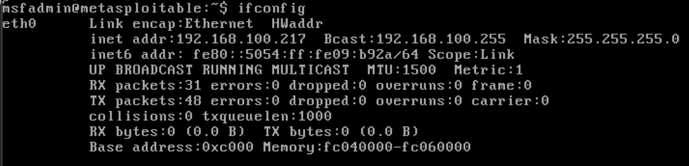
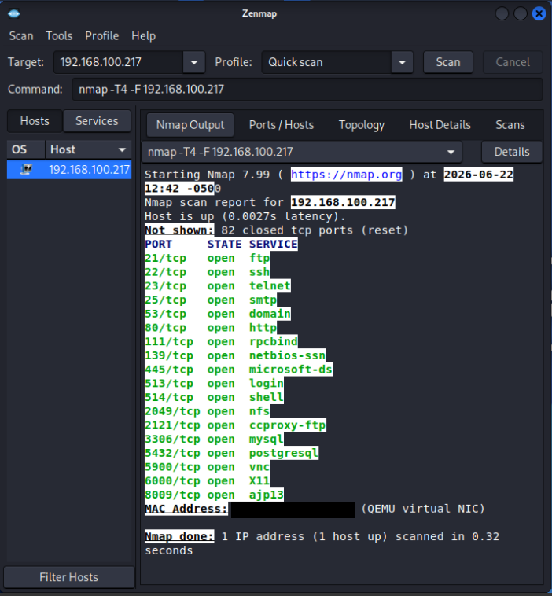

# Local Security Lab: QEMU/KVM Network Sandbox

## 📌 Project Overview
This repository documents the architecture and initial discovery phase of my local cybersecurity lab. The objective of this project was to deploy an isolated virtualization environment to analyze network vulnerabilities, practice asset discovery, and understand the core defensive controls required to remediate infrastructure risks.

---

## 🛠️ Environment Architecture
The lab is built natively on **Garuda Linux (Arch-based)** using the **QEMU/KVM** hypervisor, bypassing automated type-2 hypervisors to gain a deeper understanding of virtual interface management.

* **Attacker Machine:** Kali Linux (Rolling Release)
* **Target Machine:** Metasploitable 2 (Legacy 32-bit Linux environment, deployed via a generic OS profile)
* **Network Topology:** Both VMs are hosted on a strictly isolated virtual network segment named `isolated-labs` to ensure safe security testing.

---

## 🔍 Phase 1: Asset Discovery & Vulnerability Identification

Using **ifconfig** from the Metasploitable 2 terminal, I found the IP Address (inet addr): `192.168.100.217`.

Using **Zenmap/Nmap** from the Kali attacker instance, I conducted an initial sweep of the target environment (`192.168.100.217`). 

### Key Findings:
The target machine revealed a massive, unhardened attack surface with numerous critical ports exposed:
* **Unencrypted Management Protocols:** Telnet (Port 23) and FTP (Port 21) are actively running.
* **Database Services:** MySQL (Port 3306) and PostgreSQL (Port 5432) are fully exposed to the local segment.

### Verification (Methodology Without Scripts):
To validate the risk without relying on automated exploit payloads, I utilized a basic Telnet connection to target port 23. 
1. **Access Granted:** The system accepted default administrative credentials seamlessly.
2. **Denial of Service (DoS) Execution:** By executing native administrative commands (`ifconfig` followed by `poweroff`), I successfully initiated a complete remote shutdown of the target system from the attacker terminal, validating a critical flaw in administrative boundary controls.

---

## 🛡️ GRC & Engineering Remediation Strategy
From a Technical Governance, Risk, and Compliance (GRC) perspective, this environment highlights severe failures in core baseline controls. A production environment would require the following remediations:

1. **Enforce Least Privilege:** Standard remote sessions should lack the authorization to invoke kernel power state changes (`poweroff`).
2. **Protocol Migration:** Decommission Telnet (Port 23) entirely and enforce encrypted SSH (Port 22) transport for all remote administration.
3. **Hardening Baselines:** Implement mandatory strong password policies to eliminate default factory credentials before deployment.

# cyberlab_20260622__kali-zenmap_metasploitable-2-ifconfig
